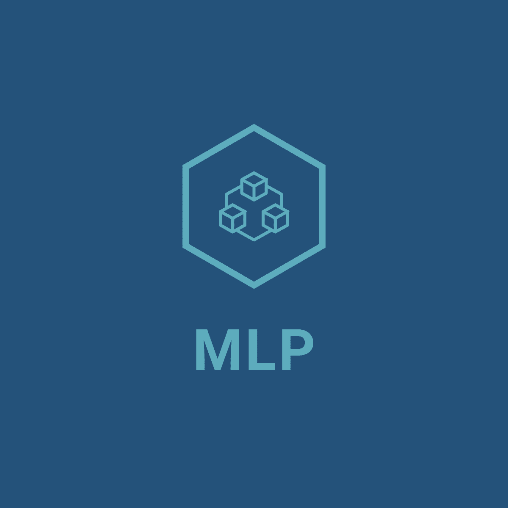

<div id="top"></div>

[![Stargazers][stars-shield]][stars-url]
[![Issues][issues-shield]][issues-url]
[![MIT License][license-shield]][license-url]


# CK3-Mod-Localization-Patch

<!-- PROJECT LOGO -->
<br />
<div align="center">
  <a href="https://github.com/tomchang25/ck3-mod-localization-patch">
    
  </a>

  <h3 align="center">CK3-Mod-Localization-Patch</h3>

  <p align="center">
    An awesome README template to jumpstart your projects!
    <br />
    <a href="https://github.com/tomchang25/ck3-mod-localization-patch">View Demo</a>
    ·
    <a href="https://github.com/tomchang25/ck3-mod-localization-patch/issues">Report Bug</a>
    ·
    <a href="https://github.com/tomchang25/ck3-mod-localization-patch/issues">Request Feature</a>
  </p>
</div>

<!-- ABOUT THE PROJECT -->
## About The Project

[![Product Name Screen Shot][product-screenshot]](https://github.com/tomchang25/ck3-mod-localization-patch)

Many great mods are available on Crusader Kings 3; however, not all of the mods have all language localization files. So there are many unreadable variables when people use this mod. I want to create an easy app that it'll be able to patch this mod, so people can use their native language without unreadable words like UNREAD_KEY_DES.

Here's why:
* Easy to use: you just click one button and let the app do all other jobs.
* Compatible with original translation: the app will detect original translation and only patch the sentence not included in the original translation.

<p align="right">(<a href="#top">back to top</a>)</p>

### Built With

* [![Python][Python]][Python-url]
* [![React][React.js]][React-url]
* [![Electron][Electron.js]][Electron-url]

<p align="right">(<a href="#top">back to top</a>)</p>


<!-- GETTING STARTED -->
## Getting Started

This is an example of how you may give instructions on setting up your project locally.
To get a local copy up and running follow these simple example steps.

### Prerequisites

This is an example of how to list things you need to use the software and how to install them.
* npm
  ```sh
  npm install npm@latest -g
  ```

### Installation

_Below is an example of how you can instruct your audience on installing and setting up your app. This template doesn't rely on any external dependencies or services._

1. Get a free API Key at [https://example.com](https://example.com)
2. Clone the repo
   ```sh
   git clone https://github.com/your_username_/Project-Name.git
   ```
3. Install NPM packages
   ```sh
   npm install
   ```
4. Enter your API in `config.js`
   ```js
   const API_KEY = 'ENTER YOUR API';
   ```

<p align="right">(<a href="#top">back to top</a>)</p>


<!-- USAGE EXAMPLES -->
## Usage

Use this space to show useful examples of how a project can be used. Additional screenshots, code examples and demos work well in this space. You may also link to more resources.

_For more examples, please refer to the [Documentation](https://example.com)_

<p align="right">(<a href="#top">back to top</a>)</p>


<!-- ROADMAP -->
## Roadmap

- [x] Add Changelog
- [x] Add back to top links
- [ ] Add Additional Templates w/ Examples
- [ ] Add "components" document to easily copy & paste sections of the readme
- [ ] Multi-language Support
    - [ ] Chinese
    - [ ] Spanish

See the [open issues](https://github.com/othneildrew/Best-README-Template/issues) for a full list of proposed features (and known issues).

<p align="right">(<a href="#top">back to top</a>)</p>


<!-- CONTRIBUTING -->
## Contributing

Contributions are what make the open source community such an amazing place to learn, inspire, and create. Any contributions you make are **greatly appreciated**.

If you have a suggestion that would make this better, please fork the repo and create a pull request. You can also simply open an issue with the tag "enhancement".
Don't forget to give the project a star! Thanks again!

1. Fork the Project
2. Create your Feature Branch (`git checkout -b feature/AmazingFeature`)
3. Commit your Changes (`git commit -m 'Add some AmazingFeature'`)
4. Push to the Branch (`git push origin feature/AmazingFeature`)
5. Open a Pull Request

<p align="right">(<a href="#top">back to top</a>)</p>


<!-- LICENSE -->
## License

Distributed under the MIT License. See `LICENSE.txt` for more information.

<p align="right">(<a href="#top">back to top</a>)</p>


<!-- CONTACT -->
## Contact

Your Name - [@your_twitter](https://twitter.com/your_username) - email@example.com

Project Link: [https://github.com/your_username/repo_name](https://github.com/your_username/repo_name)

<p align="right">(<a href="#top">back to top</a>)</p>


<!-- ACKNOWLEDGMENTS -->
## Acknowledgments

Use this space to list resources you find helpful and would like to give credit to. I've included a few of my favorites to kick things off!

* [Choose an Open Source License](https://choosealicense.com)
* [GitHub Emoji Cheat Sheet](https://www.webpagefx.com/tools/emoji-cheat-sheet)
* [Malven's Flexbox Cheatsheet](https://flexbox.malven.co/)
* [Malven's Grid Cheatsheet](https://grid.malven.co/)
* [Img Shields](https://shields.io)
* [GitHub Pages](https://pages.github.com)
* [Font Awesome](https://fontawesome.com)
* [React Icons](https://react-icons.github.io/react-icons/search)

<p align="right">(<a href="#top">back to top</a>)</p>


<!-- MARKDOWN LINKS & IMAGES -->
<!-- https://www.markdownguide.org/basic-syntax/#reference-style-links -->
[stars-shield]: https://img.shields.io/github/stars/tomchang25/ck3-mod-localization-patch.svg?style=for-the-badge
[stars-url]: https://github.com/tomchang25/ck3-mod-localization-patch/stargazers
[issues-shield]: https://img.shields.io/github/issues/tomchang25/ck3-mod-localization-patch.svg?style=for-the-badge
[issues-url]: https://github.com/tomchang25/ck3-mod-localization-patch/issues
[license-shield]: https://img.shields.io/github/license/tomchang25/ck3-mod-localization-patch.svg?style=for-the-badge
[license-url]: https://github.com/tomchang25/ck3-mod-localization-patch/LICENSE.txt
[product-screenshot]: images/screenshot.png

<!-- Language link  -->
[Python]: https://img.shields.io/badge/Python-00000?style=for-the-badge&logo=python&logoColor=white
[Python-url]: https://www.python.org/
[React.js]: https://img.shields.io/badge/React-20232A?style=for-the-badge&logo=react&logoColor=61DAFB
[React-url]: https://reactjs.org/
[Electron.js]: https://img.shields.io/badge/Electron-35495E?style=for-the-badge&logo=electron&logoColor=4FC08D
[Electron-url]: https://www.electronjs.org/
